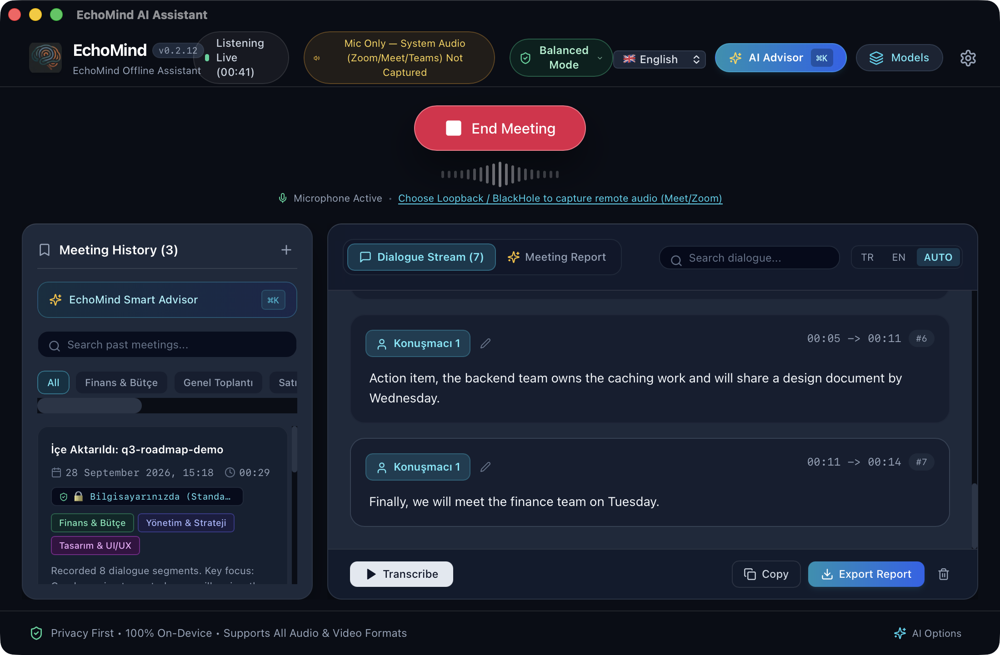
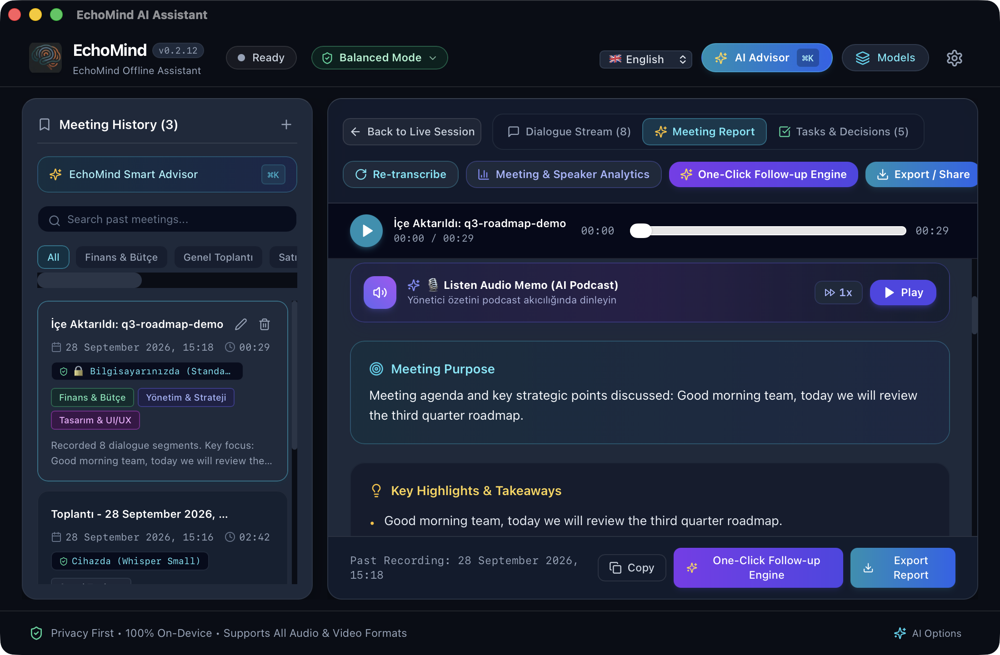
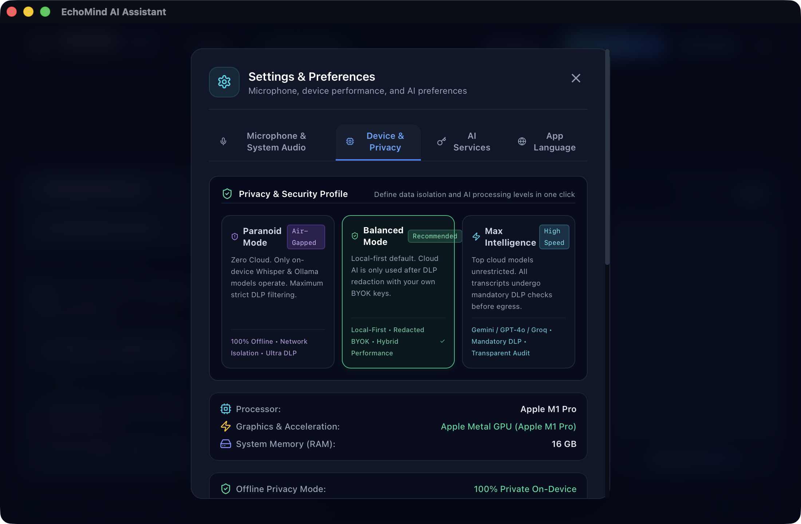
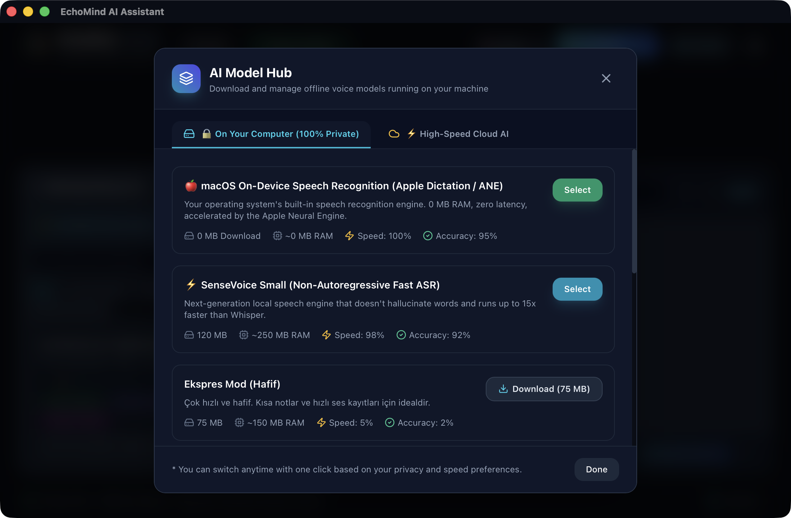

<div align="center">

# 🎙️ EchoMind AI Assistant
### **Hardware-Aware Hybrid AI Meeting Intelligence & Zero-Trust Knowledge Platform**
*Donanım Farkındalıklı Hibrit Yapay Zekâ Toplantı Asistanı & Sıfır-Güven Bilgi Platformu*

---

[](https://github.com/sewox/EchoMind/releases/latest)
[](https://github.com/sewox/EchoMind/actions)
[](https://github.com/sewox/EchoMind)
[](https://tauri.app)
[](https://www.rust-lang.org)
[](LICENSE)

<br/>

**[🇹🇷 Türkçe Dökümantasyon](#-türkçe-dökümantasyon)** &nbsp;•&nbsp; **[🇬🇧 English Documentation](#-english-documentation)** &nbsp;•&nbsp; **[📦 İndir / Downloads](#-hızlı-indirme--downloads)**

<br/>

</div>

---

## 🖼️ Ekran Görüntüleri / Screenshots

<p align="center">
  
  
  
  
</p>

<p align="center"><sub>Gerçek uygulama ekran görüntüleri (macOS, v0.2.12). Türkçe set: <code>docs/assets/screenshots/macos-*.png</code> • English set: <code>docs/assets/screenshots/en/</code></sub></p>

---

## 📦 Hızlı İndirme / Downloads

| Platform | Format | Açıklama / Description | İndirme / Download |
|---|---|---|---|
| **Windows (x64)** | `.exe` | Standart Windows Kurulum Paketi (NSIS) / Standard installer | [⬇️ **EchoMind_0.2.13_x64-setup.exe**](https://github.com/sewox/EchoMind/releases/download/v0.2.13/EchoMind_0.2.13_x64-setup.exe) |
| **Windows (x64)** | `.msi` | Kurumsal Windows Installer / Enterprise installer | [⬇️ **EchoMind_0.2.13_x64_en-US.msi**](https://github.com/sewox/EchoMind/releases/download/v0.2.13/EchoMind_0.2.13_x64_en-US.msi) |
| **macOS (Apple Silicon)** | `.dmg` | Apple Silicon (M1/M2/M3/M4) Disk İmajı / Disk image | [⬇️ **EchoMind_0.2.13_aarch64.dmg**](https://github.com/sewox/EchoMind/releases/download/v0.2.13/EchoMind_0.2.13_aarch64.dmg) |
| **Linux (Debian / Ubuntu)** | `.deb` | Debian, Ubuntu x64 Kurulum Paketi / Package | [⬇️ **EchoMind_0.2.13_amd64.deb**](https://github.com/sewox/EchoMind/releases/download/v0.2.13/EchoMind_0.2.13_amd64.deb) |
| **Linux (Fedora / RHEL)** | `.rpm` | Fedora, RHEL, openSUSE x64 Paketi / Package | [⬇️ **EchoMind-0.2.13-1.x86_64.rpm**](https://github.com/sewox/EchoMind/releases/download/v0.2.13/EchoMind-0.2.13-1.x86_64.rpm) |
| **Linux (Taşınabilir / All)** | `.AppImage` | Bağımsız Çalıştırılabilir Linux Paketi / Portable | [⬇️ **EchoMind_0.2.13_amd64.AppImage**](https://github.com/sewox/EchoMind/releases/download/v0.2.13/EchoMind_0.2.13_amd64.AppImage) |

Tüm sürümler ve sürüm notları / All versions and release notes: **[Releases](https://github.com/sewox/EchoMind/releases)** • Intel Mac için henüz paket yok / No Intel Mac build yet.

> ⚠️ **İlk açılış / First launch:** Paketler henüz Apple/Microsoft tarafından imzalanmadığı için işletim sistemi uyarı verebilir; aşağıdaki [Kurulum](#1-kurulum) / [Installation](#1-installation) adımlarına bakın.
> The installers are not yet code-signed, so your OS may warn on first launch — see the installation steps below.

---

<br/>

# 🇹🇷 Türkçe Dökümantasyon

## 💡 EchoMind Nedir?
**EchoMind**, toplantılarınızı anlık olarak dinleyen, donanımınızın gücünü (Apple Silicon Metal, NVIDIA CUDA veya CPU) otomatik analiz eden ve **%100 gizlilikle** konuşmaları yazıya döken yeni nesil masaüstü yapay zekâ asistanıdır.

Zoom, Google Meet, Microsoft Teams ve yüz yüze toplantılarda konuşmacıları tanır, aksiyon maddelerini çıkarır, toplantılar arası semantik hafızası ile geçmiş konuşmalarınızı tarar ve verilerinizi **Kurumsal Sıfır-Güven (Zero-Trust) DLP ve Disk Şifreleme** standartlarıyla korur.

---

## ✨ Temel Yetenekler ve Özellikler

### 1. ⚡ 3 Katmanlı Donanım Farkındalıklı Model Mimarisi (3-Tier Hybrid AI)
EchoMind, kullanıcılarına tam model özgürlüğü ve sıfır bağımlılık (zero vendor lock-in) sunar:
- **Katman 1: %100 Yerel Donanım (Bare-Metal):**
  - **Whisper.cpp (Apple Metal GPU, NVIDIA CUDA, CPU AVX2):** Sesler bilgisayarınızdan asla çıkmaz, sıfır internet ve sıfır abonelikle %100 yerel transkripsiyon.
  - Cihazınızın GPU (Metal, CUDA), RAM ve CPU kapasitesini analiz ederek en uygun modeli (Tiny, Base, Small, Medium, Large) otomatik önerir.
- **Katman 2: Kendi Yerel/Ağ LLM Sunucun (Self-Hosted Ollama & vLLM):**
  - Kendi bilgisayarınızda veya yerel ağınızda (LAN/Sunucu) koşan **Ollama (`http://localhost:11434`)**, **vLLM**, **LocalAI** veya özel **OpenAI-uyumlu uç noktaları** tek tıkla bağlayın.
  - `Llama 3`, `Gemma 2`, `Mistral`, `Qwen` gibi açık kaynaklı LLM'lerle sınırsız ve gizli toplantı özeti ve analiz üretin.
- **Katman 3: Genel Bulut Sağlayıcıları (Kendi API Anahtarınla / BYOK):**
  - Aylık aracı abonelik ücreti ödemeden, kendi API anahtarınızla ultra hızlı analiz için **Google Gemini (1.5 Pro / Flash)**, **Groq (Llama 3 70B & Whisper-v3)** ve **OpenAI (GPT-4o / Whisper Cloud)** modellerini kullanın.
  - **İstemci Taraflı DLP Güvencesi:** Buluta gönderilmeden önce tüm hassas veriler (TCKN, Kredi Kartı, API anahtarları, şifreler) cihazınızda maskelenir (`[REDACTED]`), böylece bulut sağlayıcılarına asla ham şirket sırları gitmez.

### 2. 🛡️ Kurumsal Seviye Güvenlik & DLP Koruması (Zero-Trust Architecture)
- **Canlı Veri Sızıntısı Önleme (DLP):** Toplantı metinlerindeki **TCKN (Mod algoritması doğrulamalı)**, **Kredi Kartı Numaraları (Luhn algoritmalı)**, **IBAN**, **API Anahtarları** (`sk-...`, `gsk_...`, `AIzaSy...`, AWS/GitHub tokenları), **E-posta** ve **Telefon** bilgilerini anında tespit edip `[REDACTED_...]` olarak maskeler.
- **Disk Veri Şifreleme (Data-at-Rest):** Toplantı geçmişi ve transkriptler diske **ChaCha20-Poly1305** kriptografik standardıyla donanıma bağlı anahtarla şifrelenerek yazılır.
- **Güvenli Kimlik Kasası (Credential Vault):** API anahtarlarınız asla düz metin (`plaintext`) saklanmaz, güvenli şifreli kasada tutulur.
- **Prompt Injection & XSS Savunması:** Transkriptler XML sınırları içine izole edilir, zararlı komut enjeksiyonları filtrelenir ve dışa aktarılan notlar sanitize edilir.

### 3. 🎙️ Konuşmacı Ayrıştırma (Diarization) & Akıllı Konuşma Analitiği
- **Otomatik Konuşmacı Tanıma:** Toplantıdaki farklı kişileri akustik frekanslarına göre ayrıştırır (`Konuşmacı 1`, `Konuşmacı 2`).
- **Doğal Hitap Tespiti:** Konuşma içerisindeki hitaplardan (örn. *"Ahmet bey ne düşünüyorsunuz?"*) konuşmacı isimlerini otomatik öğrenir.
- **Toplantı Denge Skoru (Talk-to-Listen Ratio):** Konuşmacıların konuşma sürelerini, toplantı dengesini ve katılım oranlarını görsel grafiklerle sunar.

### 4. 🧠 Toplantılar Arası Semantik Hafıza (Cross-Meeting Memory)
- **Global Bilgi Bankası:** Sadece mevcut toplantıyı değil, aylar önceki toplantılarınızı da tarar.
- **Doğal Dilde Soru Sorun:** *"Geçen ay bütçe konusunda Mehmet ne demişti?"* veya *"Pazarlama stratejisi toplantısındaki kararlar nelerdi?"* gibi sorulara anında transkript alıntılarıyla yanıt verir.

### 5. ✂️ 1-Tıkla Ses Kesiti (Soundbite Clipper) & Mini Podcast Çalar
- **Kritik Anları Kesin:** Toplantının en önemli anlarını tek tıkla 15s - 60s ses kesitleri halinde kırpın.
- **Özet Ses Memo / Podcast Oynatıcı:** Toplantının özetini dinlenebilir ses formatında dahili mini oynatıcı ile takip edin.

### 6. 🏝️ Dinamik Ada (Dynamic Island) & HUD Overlay
- Ekranınızı kaplamayan, toplantı sırasında ekranın üst kısmında zarifçe konumlanan minimal kontrol adası.
- Canlı transkript akışını, ses seviyesini ve toplantı süresini dikkatinizi dağıtmadan izleyin.

### 7. 📤 Zengin Formatlarda Dışa Aktarma
- **Toplantı Tutanağı (Markdown, HTML, PDF):** Yönetici özeti, ana başlıklar, tartışma maddeleri.
- **Takip E-postası (Follow-up Email):** Toplantı biter bitmez tüm katılımcılara gönderilmeye hazır profesyonel e-posta taslağı.
- **Slack & Teams Formatı:** Tek tıkla kopyalanıp kanallara yapıştırılabilen şık biçimlendirme.
- **Aksiyon Listesi (CSV / Tablo):** Görevler, sorumlu kişiler ve teslim tarihleri tablosu.

---

## 🚀 Son Kullanıcı Başlangıç Kılavuzu

### 1. Kurulum
Kurulum dosyalarını [son sürüm sayfasından](https://github.com/sewox/EchoMind/releases/latest) veya yukarıdaki tablodan indirin.

- **Windows:** `EchoMind_0.2.13_x64-setup.exe` dosyasını çalıştırın. *"Windows bilgisayarınızı korudu"* (SmartScreen) uyarısı çıkarsa **Ek bilgi → Yine de çalıştır**'a tıklayın.
- **macOS (Apple Silicon):** `EchoMind_0.2.13_aarch64.dmg` dosyasını açıp `EchoMind`'ı `Applications` klasörüne sürükleyin. Uygulama henüz Apple tarafından imzalanmadığı için ilk açılışta *"EchoMind hasarlı ve açılamıyor"* uyarısı görebilirsiniz. Terminal'de bir kez şunu çalıştırın:
  ```bash
  xattr -dr com.apple.quarantine /Applications/EchoMind.app
  ```
  İlk açılışta mikrofon ve Anahtarlık (Keychain) erişimine izin verin; toplantı geçmişiniz Anahtarlık'ta saklanan anahtarla şifrelenir.
- **Linux (Debian/Ubuntu):** `sudo apt install ./EchoMind_0.2.13_amd64.deb`
- **Linux (Fedora/RHEL):** `sudo dnf install ./EchoMind-0.2.13-1.x86_64.rpm`
- **Linux (AppImage):** `chmod +x EchoMind_0.2.13_amd64.AppImage && ./EchoMind_0.2.13_amd64.AppImage`

### 2. İlk Çalıştırma & Ayarlar
1. Uygulamayı açtığınızda **Donanım Algılayıcı (Smart Advisor)** donanımınızı tarayarak en uygun çalışma modunu önerir.
2. Sağ üstteki **Çark (Ayarlar)** simgesine tıklayın:
   - **Model Hub:** Bulut modelleri (OpenAI, Gemini, Groq) veya yerel Ollama/Whisper modellerinizi seçin.
   - **DLP ve Gizlilik:** Hassas verilerin (Kredi Kartı, TCKN, Telefon vb.) otomatik maskelenmesini aktif edin.
   - **Dil Seçimi:** Türkçe, İngilizce, Almanca, Fransızca veya İspanyolca arayüz dilini belirleyin.

### 3. Canlı Toplantı Başlatma
- **Kaydı Başlat:** Ana ekrandaki kırmızı **"Kaydı Başlat"** butonuna tıklayın.
- Toplantı boyunca konuşmalar anlık olarak dökümlenecek ve konuşmacılar ayrıştırılacaktır.
- İstediğiniz an **Dinamik Ada (HUD)** moduna geçerek uygulamayı ekranın köşesinde minimal bir çubuk olarak tutabilirsiniz.

### 4. Ses Dosyası İçe Aktarma
- Elinizdeki hazır toplantı kayıtlarını (`.mp3`, `.wav`, `.m4a`, `.flac`) ana ekrana sürükleyip bırakarak veya **"Ses Dosyası Yükle"** butonuna tıklayarak saniyeler içinde transkript ve özet çıkartabilirsiniz.

### 5. Özet & Not Alma
- Toplantıyı durdurduktan sonra **"Rapor & Özet"** sekmesine geçin.
- **"Özet Oluştur"** butonuna basarak Yönetici Özeti, Alınan Kararlar ve Aksiyon Maddelerini hazır bulun.
- **"Dışa Aktar"** butonuna tıklayarak Markdown, HTML, Slack veya Takip E-postası olarak çıktınızı alın.

---

<br/>

# 🇬🇧 English Documentation

## 💡 What is EchoMind?
**EchoMind** is a next-generation desktop AI meeting intelligence assistant that listens to your meetings in real-time, inspects your local hardware capabilities (Apple Silicon Metal, NVIDIA CUDA, or CPU), and transcribes conversations with **100% privacy and zero-trust security**.

Designed for Zoom, Google Meet, Teams, and in-person discussions, EchoMind performs speaker diarization, automatically detects action items, searches across all historical meetings with a cross-meeting semantic memory engine, and protects corporate trade secrets with enterprise-grade **DLP and Data-at-Rest Encryption**.

---

## ✨ Key Features & Highlights

### 1. ⚡ 3-Tier Flexible Model Architecture (Zero Vendor Lock-In)
EchoMind offers total freedom over how and where your audio and LLM intelligence is processed:
- **Tier 1: 100% Local & Bare-Metal Hardware:**
  - **Whisper.cpp (Apple Metal GPU, NVIDIA CUDA, CPU AVX2):** 100% offline, private transcription directly on your machine with zero cloud dependency and zero subscriptions.
  - Automatically assesses local GPU memory and CPU threads to recommend the optimal model size (Tiny to Large).
- **Tier 2: Self-Hosted LLMs (Local Ollama, vLLM & Custom Servers):**
  - Seamlessly connect to your local or private network **Ollama (`http://localhost:11434`)**, **vLLM**, **LocalAI**, or custom **OpenAI-compatible server**.
  - Run unrestricted private meeting summaries with open-weights models like `Llama 3`, `Gemma 2`, `Mistral`, or `Qwen`.
- **Tier 3: Public Cloud Providers (Bring Your Own Key / BYOK):**
  - Connect your own API keys for **Google Gemini (1.5 Pro / Flash)**, **Groq (Llama 3 70B Ultra-Fast & Whisper-v3)**, and **OpenAI (GPT-4o)** with zero middleman SaaS markup.
  - **Client-Side DLP Assurance:** All sensitive credentials, card numbers, IBANs, and IDs are sanitized *before* reaching external APIs.

### 2. 🛡️ Enterprise Zero-Trust Security & DLP Guard
- **Real-Time DLP Masking:** Automatically sanitizes **Credit Cards (Luhn algorithm)**, **National IDs**, **IBANs**, **API Keys** (`sk-...`, `gsk_...`, AWS/GitHub keys), **Emails**, and **Phone Numbers**.
- **Data-at-Rest Encryption (ChaCha20-Poly1305):** Encrypts all stored meetings, transcripts, and embeddings with hardware-derived keys.
- **Encrypted Credential Vault:** Securely protects external API keys from plaintext file exposure.
- **Prompt Injection & Stored XSS Mitigation:** Isolated execution boundaries (`<transcript>`) and strict Content Security Policy (`default-src 'self'`).

### 3. 🎙️ Acoustic Diarization & Conversational Analytics
- **Speaker Recognition:** Identifies and separates distinct speakers acoustically.
- **Automatic Name Resolution:** Detects speaker identities naturally from conversation context.
- **Meeting Balance Score:** Visualizes talk-to-listen ratios and participation balance.

### 4. 🧠 Cross-Meeting Semantic Memory
- Ask questions across your entire meeting history in natural language (e.g., *"What did Sarah decide about the Q3 budget last month?"*).
- Instant citation jumps to exact audio timestamps.

### 5. ✂️ Soundbite Clipper & Audio Memo Player
- Clip vital 15s to 60s discussion soundbites with a single click.
- Built-in mini podcast audio memo player to review key meeting summaries on the go.

### 6. 🏝️ Dynamic Island HUD & Overlay
- Compact, unobtrusive floating island display that stays on top during video conferences.

### 7. 📤 Multi-Format Exporting
- **Executive Meeting Notes:** Markdown, standalone HTML, formatted PDF.
- **Follow-up Emails:** Pre-drafted emails ready to send to all participants.
- **Team Channels:** Formatted for Slack and Microsoft Teams.
- **Action Item Tables:** Clean CSV exports with assignees and due dates.

---

## 🛠️ Quick Start Guide

### 1. Installation
Download the installer from the [latest release](https://github.com/sewox/EchoMind/releases/latest) or the table above.

- **Windows:** Run `EchoMind_0.2.13_x64-setup.exe`. If SmartScreen shows *"Windows protected your PC"*, click **More info → Run anyway**.
- **macOS (Apple Silicon):** Open `EchoMind_0.2.13_aarch64.dmg` and drag `EchoMind` to `Applications`. The app is not notarized by Apple yet, so macOS may say *"EchoMind is damaged and can't be opened"* on first launch. Run this once in Terminal:
  ```bash
  xattr -dr com.apple.quarantine /Applications/EchoMind.app
  ```
  Allow microphone and Keychain access on first launch; your meeting history is encrypted with a key stored in the Keychain.
- **Linux (Debian/Ubuntu):** `sudo apt install ./EchoMind_0.2.13_amd64.deb`
- **Linux (Fedora/RHEL):** `sudo dnf install ./EchoMind-0.2.13-1.x86_64.rpm`
- **Linux (AppImage):** `chmod +x EchoMind_0.2.13_amd64.AppImage && ./EchoMind_0.2.13_amd64.AppImage`

### 2. Getting Started
1. Launch the app and allow the **Smart Advisor** to detect your hardware.
2. Open **Settings (Gear Icon)** to customize:
   - **Model Hub:** Connect cloud providers or local Ollama instances.
   - **Privacy & DLP:** Toggle automated PII & credential redaction.
   - **Language:** Choose between English, Turkish, German, French, and Spanish.
3. Click **"Start Recording"** to capture live meetings, or drag-and-drop existing audio files (`.mp3`, `.wav`, `.m4a`, `.flac`).
4. Generate instant executive summaries, extract action items, and export with one click.

---

## ⌨️ Keyboard Shortcuts / Kısayollar

| Kısayol / Shortcut | İşlev / Action |
| :--- | :--- |
| `Space` (Boşluk) | Kaydı Başlat / Duraklat (Start / Pause Recording) |
| `Esc` | Modalı veya HUD'ı Kapat (Close Modal or Island HUD) |
| `Ctrl / Cmd + F` | Toplantı İçi ve Global Hafızada Arama (Search Memory) |
| `Ctrl / Cmd + E` | Dışa Aktarma Penceresini Aç (Open Export Dialog) |
| `Ctrl / Cmd + ,` | Ayarları Aç (Open Settings) |

---

## 💻 Geliştirici Kurulumu / Developer Setup

Projeyi yerel ortamınızda derlemek ve geliştirmek için:

**Linux (Debian/Ubuntu) sistem bağımlılıkları** — Tauri, ses ve OS Secret Service (şifreli anahtar deposu) için:

```bash
sudo apt-get update
sudo apt-get install -y \
  build-essential cmake clang pkg-config \
  libgtk-3-dev libwebkit2gtk-4.1-dev libappindicator3-dev librsvg2-dev \
  libasound2-dev libssl-dev libdbus-1-dev patchelf
```

```bash
# 1. Depoyu klonlayın
git clone https://github.com/sewox/EchoMind.git
cd EchoMind

# 2. Bağımlılıkları yükleyin
npm install

# 3. Geliştirici sunucusunu ve Tauri uygulamasını başlatın
npm run dev
npm run tauri dev

# 4. Testleri çalıştırın
npm run typecheck       # TypeScript Kontrolü
npm run lint            # ESLint Kontrolü
npm run test:coverage   # Vitest Frontend Testleri (251 Test)
npm run test:rust       # Cargo Backend Testleri (66 Test)
```

---

## 📄 Lisans / License

Bu proje **[MIT Lisansı](LICENSE)** altında lisanslanmıştır.  
This project is licensed under the terms of the **MIT License**.

<div align="center">
  <br/>
  <b>Built with ❤️ by EchoMind Team</b>
</div>
